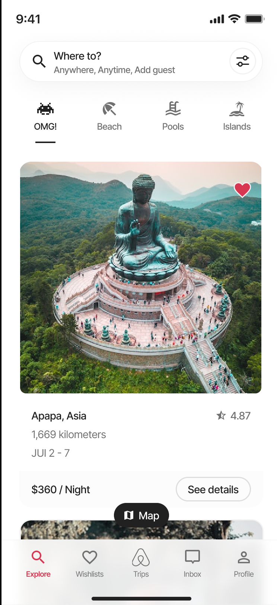
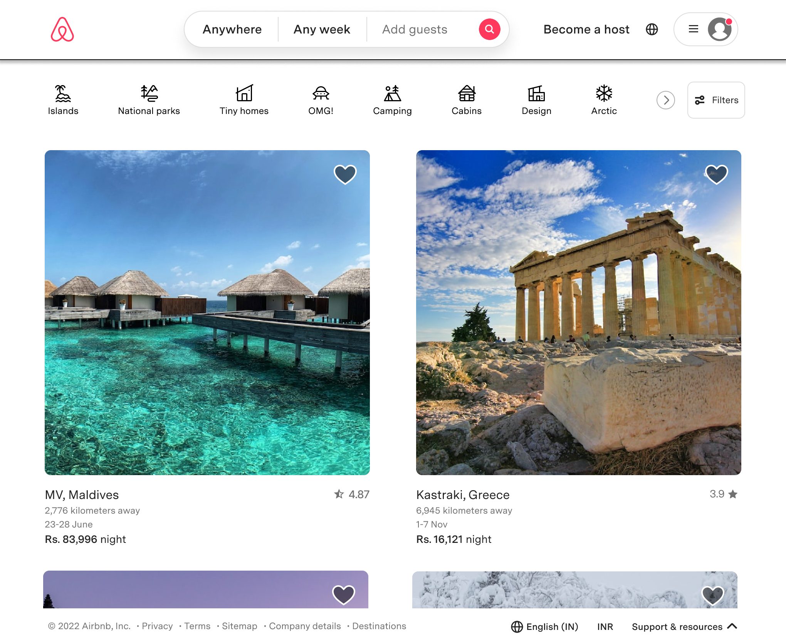
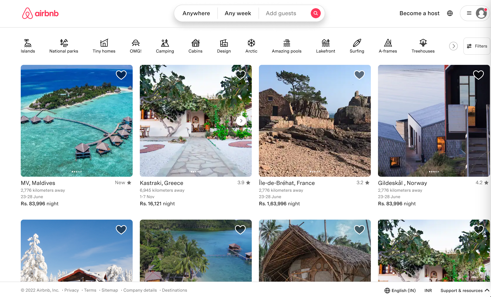

# Project 1 - HTML and CSS

## Acceptance criteria

### HTML:

- [x] Create a semantic HTML structure where `section` and `article` elements take precedence over `div` elements, as long as their use is correct. Wrap the content in a `main` element.
- [x] Include at least one `header` element or one `footer` element for navigation or additional content.
- [x] Add at least one `ul` or `ol` element to list relevant information.
- [x] Insert images that fit the chosen theme.
- [x] Include links that point to relevant information. Remember to use `rel="noopener"` for external website links.

### CSS:

- [x] Apply global styles to add `box-sizing: border-box;` and remove padding and margin from the `body` element.
- [x] Position elements using `flex` or `grid`.
- [x] Implement media queries to make the web responsive. Ensure it displays correctly on mobile devices smaller than `375px` and on "desktop" devices larger than "mobile".
- [x] _Bonus:_ Make the web suitable for tablets, between the ranges of `375px` and `768px`.
- [x] Define CSS variables for commonly used colors and sizes.
- [x] Configure text styles for `h1`, `h2`, `h3`, `p`, and `span` elements.
- [x] _Bonus:_ Load Google Fonts.

## Implementation:

- The project is a copy of landing page from Airbnb website. It is done just with HTML and CSS.
- I used the mobile first approach
- The website is fully responsive
- For mobile:
  - The super-header is an button for searching desting, period and number of guests
  - The header is a list of icon and categories, with a horizontal scroll
  - Both the footer and header are fixed at top and bottom
  - I added some animations: on the links of the navbar
- I used the following breakpoints:
  - Desktop: 1440px
  - Tablet: 1024px
  - Mobile: 745px

## Figma design:

### Mobile:

&nbsp;

### Tablet:

&nbsp;

### Desktop:

&nbsp;

